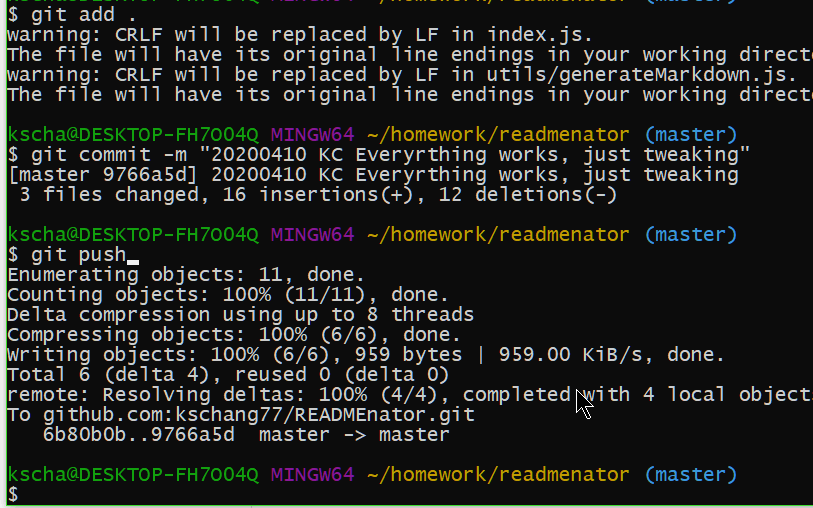

# READMEnator


  A Command-line-interface (CLI) with Node.js to generate a decent README. Not very smart, but it'll do the job, or at least get you started. 
  
## Demo

NOTE: default values subject to change. Output filename subject to change. 




# Table of Contents

## Installation

N/A?

## Usage

  run it


## Deployed Link

  https://kschang77.github.ip/READMEnator


## Project Repo

  https://github.com/kschang77/READMEnator


## Screenshot(s)

  N/A 


# Built With

* Node.js
* Axios
* Inquirer


## Code Snippet

This is the main program. Proper use of async then. yourREADME.md was chosen because I don't want the app to overwrite this README.md, right? 

```
 askQuestions().then(function (result) {
    var ret = result
    doProcessing(ret).then(function (ret2) {
      var ret3 = Object.assign(ret, ret2)
      var procData = generateMarkdown(ret3)
      writeToFile("yourREADME.md", procData)
      console.info("yourREADME.md has been written to app directory. ")
    })
  })
  }
```
  
## Stretch Goals / Future Developement

Can probably make it smarter by reading package.json files and fancier input choices, like let user pick from all the repos they have, and so on. Then let them pick a license? Then search for badges, maybe? 


## License

  copyright(c) Kasey K S Chang

  See (./LICENSE) for current license.


## Contributing

N / A


## Tests

N / A


## Questions

  * Kasey K S Chang

  * 

  * Email: null

  * Github: @https://github.com/kschang77


## Acknowledgments

  * Hat tip to Jerome, Kerwin, Mahi, and the rest of 2020 March UCB Coding Bootcamp Cohort

##### README.md generated by READMEnator https://github.com/kschang77/READMEnator
    
